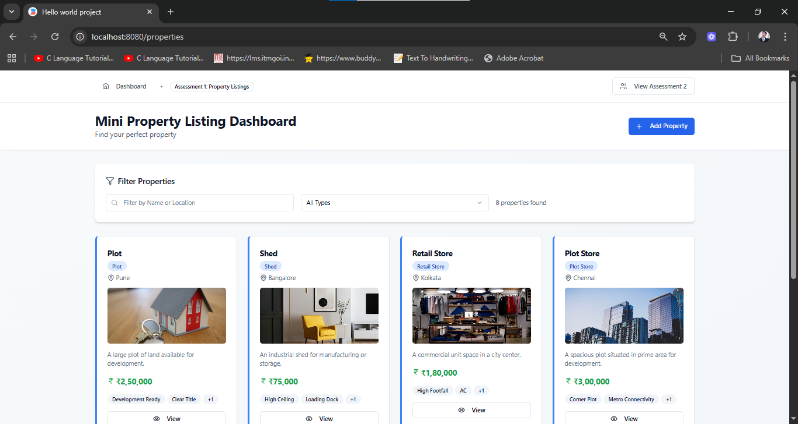
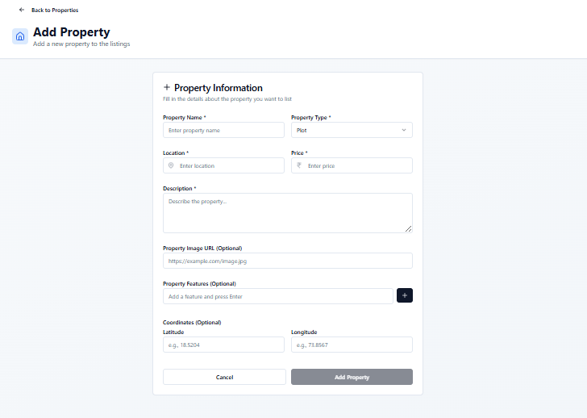
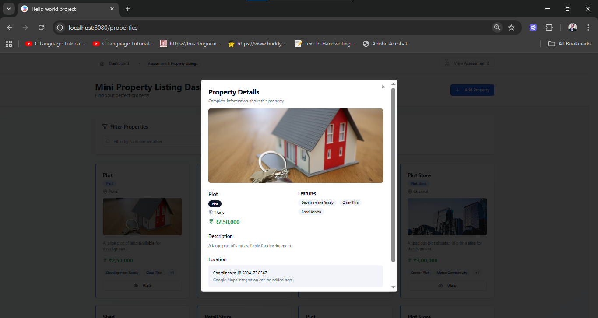
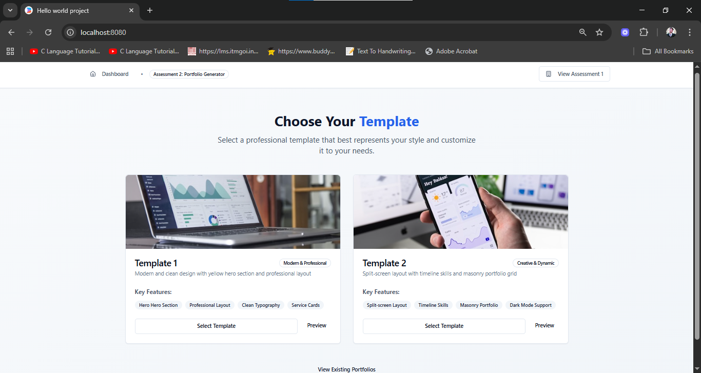
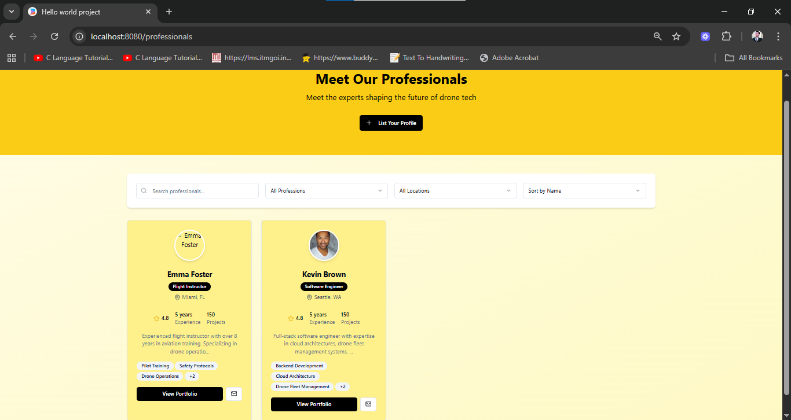
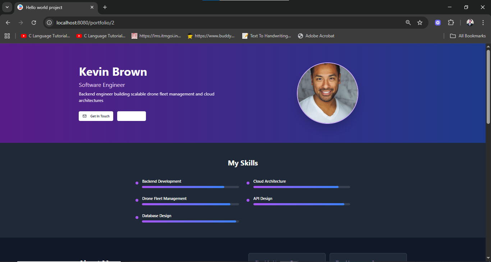

# 🏠 Property Listings App & 📑 Dynamic Portfolio Generator  

## 📌 Overview  
This repository contains two React projects developed as part of the **MERN Stack, AI Agents & AWS Developer Internship Assignment** at **IPAGE UM SERVICES PVT LTD**.  

- **Property Listings Dashboard** → A React app to manage, filter, and view property listings using a mock API.  
- **Dynamic Portfolio Generator** → A React app where users can select templates, fill forms, and generate professional portfolios dynamically.  

---

## 🚀 Features  

### 🔹 Property Listings Dashboard  
- Property Listings Page (card layout)  
- Add New Property (POST API → refresh list dynamically)  
- View Details Modal with image (Google Maps optional)  
- Filter by Property Type  
- Search by Name / Location  
- Real-time API Integration  

### 🔹 Dynamic Portfolio Generator  
- Template selection screen (2 templates)  
- Multi-section form (Hero, About Me, Skills, Services, Portfolio, Blog, Contact)  
- Professionals List Page with profile cards  
- Dynamic Portfolio Pages rendered from template  
- Search & filter functionality  

---

## 📸 Screenshots  

Here are some screenshots from the project for quick reference.  
All images are available in the `/screenshots` folder of this repository.  

### 🔹 Property Listings Dashboard  
  
  
  

---
### 🔹 Dynamic Portfolio Generator  
  
  
  

---


## 🛠 Tech Stack  
- **Frontend:** React + Vite + TypeScript  
- **Backend:** Express (Mock API) / json-server (optional)  
- **UI:** Shadcn/UI + Lucide-react  
- **State & API:** React Hooks, TanStack Query, Axios/Fetch  
- **Package Manager:** pnpm  

---

## ⚙️ Setup & Run Instructions  

### 📍 Clone Repository  
```bash
git clone https://github.com/rahul-pal-mastizone/IPAGE-UM-SERVICES-PVT-LTD-Project.git
cd IPAGE-UM-SERVICES-PVT-LTD-Project

📍 Install Dependencies
pnpm run dev

Visit: http://localhost:8080

📍 (Optional) Start Mock API with json-server
npm run api
API available at: http://localhost:5000/api

📂 Project Structure
project-root/
├─ client/               # React frontend
│  ├─ components/        # Reusable components
│  ├─ hooks/             # Custom React hooks
│  ├─ lib/               # Utility functions
│  ├─ pages/             # Pages (Listings, Portfolio, etc.)
│  ├─ App.tsx
│  ├─ global.css         # Global styles
│  └─ vite-env.d.ts      # Vite/TS environment types
│
├─ public/               # Static assets
├─ screenshots/          # Screenshots for report
│
├─ server/               # Express API (mock backend)
│  ├─ routes/            # API routes (demos.ts, portfolios.ts, properties.ts)
│  ├─ index.ts           # Server entry point
│  └─ node-build.ts      # Server build file
│
├─ .gitignore            # Git ignore rules
├─ package.json          # Dependencies & scripts
├─ pnpm-lock.yaml        # Lockfile for pnpm
├─ package-lock.json     # Lockfile for npm (optional, if you switch)
├─ tailwind.config.ts    # Tailwind CSS config
├─ postcss.config.js     # PostCSS config
├─ tsconfig.json         # TypeScript config
├─ vite.config.ts        # Vite config
├─ vite.config.server.ts # Vite server config
└─ README.md             # Documentation

```

---

## 👨‍💻 Developer

**Rahul Pal**  
📧 [rahul.pal.moderntechno@gmail.com](mailto:rahulpal.moderntechno@gmail.com)  
🔗 [LinkedIn](https://www.linkedin.com/in/rahul155/)
